# pokeemerald-expansion w/ Net Demo!

### Important: DO NOT use GitHub's "Download Zip" option. Using this option will not download the commit history required to update your expansion version or merge other feature branches. Instead, please read [this guide](https://github.com/Pawkkie/Team-Aquas-Asset-Repo/wiki/The-Basics-of-GitHub) to learn how to fork the repository and clone locally from there.

## What is pokeemerald-expansion?

pokeemerald-expansion is a decomp hack base project based off pret's [pokeemerald](https://github.com/pret/pokeemerald) decompilation project. It's recommended that any new projects that plan on using it, to clone this repository instead of pret's vanilla repository, as we regurlarly incorporate pret's documentation changes. This is ***NOT*** a standalone romhack, and as such, most features will be unavailable and/or unbalanced if played as is.

If you use pokeemerald-expansion in your hack, please add RHH (Rom Hacking Hideout) to your credits list. Optionally, you can list the version used, so it can help players know what features to expect.
You can phrase it as the following:
```
Based off RHH's pokeemerald-expansion 1.9.2 https://github.com/rh-hideout/pokeemerald-expansion/
```

## What features are included?
- ***IMPORTANT*❗❗ Read through these to learn what features you can toggle**:
    - [Battle configurations](https://github.com/rh-hideout/pokeemerald-expansion/blob/master/include/config/battle.h)
    - [Pokémon configurations](https://github.com/rh-hideout/pokeemerald-expansion/blob/master/include/config/pokemon.h)
    - [Item configurations](https://github.com/rh-hideout/pokeemerald-expansion/blob/master/include/config/item.h)
    - [Overworld configurations](https://github.com/rh-hideout/pokeemerald-expansion/blob/master/include/config/overworld.h)
    - [Debug configurations](https://github.com/rh-hideout/pokeemerald-expansion/blob/master/include/config/debug.h)
- ***Upgraded battle engine.***
    - Gen5+ damage calculation.
    - 2v2 Wild battles support.
    - 1v2/2v1 battles support.
    - Fairy Type (configurable).
    - Physical/Special/Status Category (configurable).
    - New moves and abilities up to Scarlet and Violet.
        - Custom Contest data up to SwSh, newer moves are WIP. ([source](https://pokemonurpg.com/info/contests/rse-move-list/))
    - Battle gimmick support:
        - Mega Evolution
        - Primal Reversion
        - Ultra Burst
        - Z-Moves
            - Gen 8+ damaging moves are given power extrapolated from Gen 7.
            - Gen 8+ status moves have no additional effects, like Healing Wish.
        - Dynamax and Gigantamax
    - Initial battle parameters
        - Queueing stat boosts (aka, Totem Boosts)
        - Setting Terrains.
    - Mid-turn speed recalculation.
    - Quick Poké Ball selection in Wild Battles
        - Hold `R` to change selection with the D-Pad.
        - Press `R` to use last selected Poké Ball.
    - Run option shortcut
    - Faster battle intro - Message and animation/cry happens at the same time.
    - Faster HP drain.
    - Battle Debug menu.
        - Accessed by pressing `Select` on the "Fight/Bag/Pokémon/Run" menu.
    - Option to use AI flags in wild Pokémon battles.
    - FRLG/Gen4+ whiteout money calculation.
    - Configurable experience settings
        - Experience on catch.
        - Splitting experience.
        - Trainer experience.
        - Scaled experience.
        - Unevolved experience boost.
    - Frostbite.
        - Doesn't replace freezing unless a config is enabled, so you can mix and match.
    - Critical capture.
    - Removed badge boosts (configurable).
    - Recalculating stats at the end of every battle.
    - Level 100 Pokémon can earn EVs.
    - Inverse battle support.
    - TONS of other features listed [here](https://github.com/rh-hideout/pokeemerald-expansion/blob/master/include/config/battle.h).
- ***Full Trainer customization***
    - Nickname, EVs, IVs, moves, ability, ball, friendship, nature, gender, shininess.
    - Custom tag battle support (teaming up an NPC in a double battle).
    - Sliding trainer messages.
    - Upgraded Trainer AI
        - Considers newer move effects.
        - New flag options to let you customize the intelligence of your trainers.
        - Faster calculations.
    - Specify Poké Balls by Trainer class.
- ***Pokémon Species from Generations 1-9.***
    - Simplified process to add new Pokémon.
    - Option to disable unwanted families.
    - Updated sprites to DS style.
    - Updated stats, types, abilities and egg groups (configurable).
    - Updated Hoenn's Regional Dex to match ORAS' (configurable).
    - Updated National Dex incorporating the new species.
    - Sprite and animation visualizer.
        - Accesible by pressing `Select` on a Pokémon's Summary screen.
    - Gen4+ evolution methods, with some changes:
        - Mossy Rock, Icy Rock and Magnetic Field locations match ORAS'.
            - Leaf, Ice and Thunder Stones may also be used.
        - Inkay just needs level 30 to evolve.
            - You can't physically have both the RTC and gyroscope, so we skip this requirement.
        - Sylveon uses Gen8+'s evolution method (friendship + Fairy Move).
        - Option to use hold evolution items directly like stones.
    - Hidden Abilities.
        - Available via Ability Patch.
        - Compatible with Ghoul's DexNav branch.
    - All gender differences.
        - Custom female icons for female Hippopotas Hippowdon, Pikachu and Wobbufett
    - 3 Perfect IVs on Legendaries, Mythicals and Ultra Beasts.
- ***Customizable form change tables. Full list of methods [here](https://github.com/rh-hideout/pokeemerald-expansion/blob/master/include/constants/form_change_types.h).***
    - Item holding (eg. Giratina/Arceus)
    - Item using (eg. Oricorio)
        - Time of day option for Shaymin
    - Fainting
    - Battle begin and end (eg. Xerneas)
        - Move change option for Zacian/Zamazenta
    - Battle end in terrains (eg. Burmy)
    - Switched in battle (eg. Palafin)
    - HP Threshold (eg. Darmanitan)
    - Weather (eg. Castform)
    - End of turn (eg. Morpeko)
    - Time of day (eg. Shaymin)
    - Fusions (eg. Kyurem)
- ***Breeding Improvements***
    - Incense Baby Pokémon now happen automatically (configurable).
    - Level 1 eggs (configurable).
    - Poké Ball inheriting (configurable).
    - Egg Move Transfer, including Mirror Herb (configurable).
    - Nature inheriting 100% of the time with Everstone (configurable)
    - Gen6+ Ability inheriting (configurable).
- ***Items from newer Generations. Full list [here](https://github.com/rh-hideout/pokeemerald-expansion/blob/master/include/constants/items.h).***
    - ***Gen 6+ Exp. Share*** (configurable)
    - Berserk Gene
    - Most battle items from Gen 4+
    - Existing item data but missing effects:
        - Gimmighoul Coin
        - Booster Energy
        - Tera Shards
        - Tera Orb
- ***Feature branches incorporated (with permission):***
    - [RHH intro credits](https://github.com/Xhyzi/pokeemerald/tree/rhh-intro-credits) by @Xhyzi.
        - A small signature from all of us to show the collective effort in the project :)
    - [Overworld debug](https://github.com/TheXaman/pokeemerald/tree/tx_debug_system) by @TheXaman
        - May be disabled.
        - Accesible by pressing `R + Start` in the overworld by default.
        - **Additional features**:
            - *Clear Boxes*: cleans every Pokémon from the Boxes.
            - *Hatch an Egg*: lets you choose an Egg in your party and immediately hatch it.
    - [HGSS Pokédex](https://github.com/TheXaman/pokeemerald/tree/tx_pokedexPlus_hgss) by @TheXaman
        - May be disabled.
        - **Additional features**:
            - *Support for new evolution methods*.
            - *Dark Mode*.
    - [Nature Colors](https://github.com/DizzyEggg/pokeemerald/tree/nature_color) in summary screen by @DizzyEggg
    - [Dynamic Multichoice](https://github.com/SBird1337/pokeemerald/tree/feature/dynmulti) by @SBird1337
    - [Saveblock Cleansing](https://github.com/ghoulslash/pokeemerald/tree/saveblock) by @ghoulslash
    - [Followers & Expanded IDs](https://github.com/aarant/pokeemerald/tree/followers-expanded-id) by @aarant
        - May be disabled.
        - Includes Pokémon followers like in HGSS, including interactions.
        - ***Expands the amount of possible object event IDs beyond 255.***
        - ***Includes an implementation of dynamic overworld palettes (DOWP).***
        - **Additional features**:
            - *Pokémon overworld sprites up to Generation 8.*
            - *Integration with our Pokémon Sprite Visualizer, allowing users to browse through the follower sprites alongside battle sprites.*
- ***Other features***
    - Pressing B while holding a Pokémon drops them like in modern games (configurable).
    - Running indoors (configurable).
    - Configurable overworld poison damage.
    - Configurable flags for disabling Wild encounters and Trainer battles.
    - Configurable flags for forcing or disabling Shinies.
    - Reusable TM (configurable).
    - B2W2+ Repel system that also supports LGPE's Lures
    - Gen6+'s EV cap.
    - All bugfixes from pret included.
    - Fixed overworld snow effect.

There are some mechanics, moves and abilities that are missing and being developed. Check [the project's milestones](https://github.com/rh-hideout/pokeemerald-expansion/milestones) to see which ones.


### [Documentation on features can be found here](https://github.com/rh-hideout/pokeemerald-expansion/wiki)

## If I already have a project based on regular pokeemerald, can I use pokeemerald-expansion?
Yes! Keep in mind that we keep up with pret's documentation of pokeemerald, which means that if your project a bit old, you might get merge conflicts that you need to solve manually.
- If you haven't set up a remote, run the command `git remote add RHH https://github.com/rh-hideout/pokeemerald-expansion`.
- Once you have your remote set up, run the command `git pull RHH master`.

With this, you'll get the latest version of pokeemerald-expansion, plus a couple of bugfixes that haven't been released into the next patch version :)

## **How do I update my version of pokeemerald-expansion?**
- If you haven't set up a remote, run the command `git remote add RHH https://github.com/rh-hideout/pokeemerald-expansion`.
- Check your current version.
    - You can check in the debug menu's `Utilities -> Expansion Version` option.
    - If the option is not available, you possibly have version 1.6.2 or older. In that case, please check the [changelogs](CHANGELOG.md) to determine your version based on the features available on your repository.
- Once you have your remote set up, run the command `git pull RHH expansion/X.Y.Z`, replacing X, Y and Z with the digits of the respective version you want to update to (eg, to update to 1.9.2, use `git pull RHH expansion/1.9.2`).
    - ***Important:*** If you are several versions behind, we recommend updating one minor version at a time, skipping directly to the latest patch version (eg, 1.5.3 -> 1.6.2 -> 1.7.4 and so on)
- Alternatively, you can update to unreleased versions of the expansion.
    - ***master (stable):*** It contains unreleased **bugfixes** that will come in the next patch version. To merge, use `git pull RHH master`.
    - ***upcoming (unstable, with potential bugs):*** It contains unreleased **features** that will come in the next minor version. To merge, use `git pull RHH upcoming`.

### Please consider crediting the entire [list of contributors](https://github.com/rh-hideout/pokeemerald-expansion/wiki/Credits) in your project, as they have all worked hard to develop this project :)

## There's a bug in the project. How do I let you guys know?
Please submit any issues with the project [here](https://github.com/rh-hideout/pokeemerald-expansion/issues). Make sure that the issue wasn't reported by someone else by searching using the filters.

## Can I contribute even if I'm not a member of ROM Hacking Hideout?

Yes! Contributions are welcome via Pull Requests and they will be reviewed by maintainers. Don't feel discouraged if we take a bit to review your PR, we'll get to it.

## Who maintains the project?

The project was originally started by DizzyEgg alongside other contributors.

The project has now gotten larger and DizzyEgg is now maintaining the project as part of the ROM Hacking Hideout community. Some members of this community are taking on larger roles to help maintain the project.

## What is the ROM Hacking Hideout?

A Discord-based ROM hacking community that has many members who hack using the disassembly and decompilation projects for Pokémon. Quite a few contributors to the original feature branches by DizzyEgg were members of ROM Hacking Hideout. You can call it RHH for short!

[Click here to join the RHH Discord Server!](https://discord.gg/6CzjAG6GZk)


⚠️ This project has mostly been tested on dolphin, use on real hardware at your own risk. ⚠️

> This project is in development. While it should be functional this version is only intended for use by developers. Feel free to contribute. 

# Emerald Net Demo

This project aims to add a network connection into Pokemon Emerald, using only official hardware. With some demos and a web server to test things.


## Current Demos

Several features are included to showcase the network conectivity. These crrently include:

- Returning a welcome message to display in game when connecting to the server
- Downloadable EReader Style Battles. Through the Web UI, choose 3 pokemon, nicknames, held items, moves and levels.
- Random Trades. Randomly trade with another person connected to the server.
- Downloadable Mart. Through the Web UI, pick up to 6 items for the mart to sell.
- Downloadable Gift Egg. Through Web UI choose the pokemon and allow it to have a special move. Users can only download each egg once. 

## Network Diagram

```mermaid
sequenceDiagram
    participant 🎮 GBA
    participant 📺 WII
    participant 🌐 TCP SERVER
    🎮 GBA->>📺 WII: DOL-011 Cable
    Note over 🎮 GBA,📺 WII: (JOYBUS)
    📺 WII->>🌐 TCP SERVER: WIFI
    Note over 📺 WII,🌐 TCP SERVER: (TCP)
    🌐 TCP SERVER->>📺 WII: WIFI
    Note over 🌐 TCP SERVER,📺 WII: (TCP)
    📺 WII->>🎮 GBA: DOL-011 Cable
    Note over 📺 WII,🎮 GBA: (JOYBUS)
```




## Requirements

There are two ways to get this project running:

- Dolphin (For PC) *(Version 5 or higher is recommended as this has the built in GBA link support)*  
- A PC/Server that can run nodejs 

### - OR -

- GBA or GBA SP (https://en.wikipedia.org/wiki/Game_Boy_Advance)
- Flash cart for custom games (https://en.wikipedia.org/wiki/Flash_cartridge)
- DOL-011 cable (https://en.wikipedia.org/wiki/GameCube_%E2%80%93_Game_Boy_Advance_link_cable)
- WII *(Not wii mini)* (https://en.wikipedia.org/wiki/Wii)
- WIFI Router or Wii ethernet adapter
- A PC/Server that can run nodejs 

## Software Components

There are 3 main components to this project:

- A modified version of pokeemerald with a collection of network functions for reliable communication with the Wii
- A homebrew Wii channel allowing up-to 4 GBA's to connect to the server (per wii)
- A NodeJS Server, with TCP Server for game connections and a Webserver for providing a UI for configuring the server

You can download a zip of the latest releas build here https://github.com/KittyPBoxx/pokeemerald-net-demo/releases

## Quick Start

### 1 - Get all the resources

See the 'requirements' section for all the software/hardware you can use. You also need the release zip which contains three programs.

- Celios Server, (for windows/mac/linux) that you can run as an executable
- The pokemon emerald xdelta patch that can be applied to your copy of pokemon emerald
- Pokecom Channel, both the WAD and .dol are included. So you can install the WAD as a channel or just run the .dol (whichever you prefer)

On top of these you will need

- Your Pokemon Emerald (U) backup rom\g
- A GBA bios.bin file


### 2 - Patching Emerald

- Get your copy of Emerald (U). (md5sum 605b89b67018abcea91e693a4dd25be3) 
- Get the netdemo.xdelta from the release zip
- Use this site to patch your rom. https://www.marcrobledo.com/RomPatcher.js/


### 3 - Configure Dolphin 

  - Get Dolphin >= 5, (the android release will not work as it dosn't support gba connections)

Configure the following settings

  - Open Controllers and select integrated GBA controller
  - Settings->Wii | aspect ratio should be 4:3
  - Settings->Gamecube | Load the gameboy bios.bin  
  - Settings->Gamecube | the pokeemerald rom is loaded in same port as the integrated GBA controller you are using
  - If using an exsiting save the name is updated. i.e if your rom is pokeemerald.gba and you are in port 1 the save would be called 'pokeemerald-1.sav'


The easiest way to run the wii channel is just to drag and drop the 'pokecom-channel.dol' file into dolphin.


> If you are running on a real wii, copy the whole PokecomChannel folder (including, the dol, icon.png and meta.xml) to the `apps` folder on your sd card and launch through homebrew

### 4 - Run the server

To locally host a server in windows double click on celioserver-win.exe or run it from the command line.

Once it is running you can go to the web ui by going to `localhost:8081` in your web browser

The game server runs at localhost:9000 so dolphin should automatically be able to connect if they are running on the same PC


> If you can't run a server yourself you can configure the wii channel to connect the the public test server `130.162.161.228:9000`. Be aware this is a test environment an may go offline or be unstable.

### 5 - Play the game
  
* When the wii channel launches the integrated mgba should launch at the same time
* If the wii channel does not detect the game automatically, right click the mgba window on the game screen, reset the game, and it should be picked up
* The player in the wii channel will show as "Waiting" untill you talk to the terminal at the Lilycove Network Center
* If you are starting a new save, Norman will be waiting in Oldale to take you to Lilycove. Once there head to the North-Eastern building and speak to the terminal.
